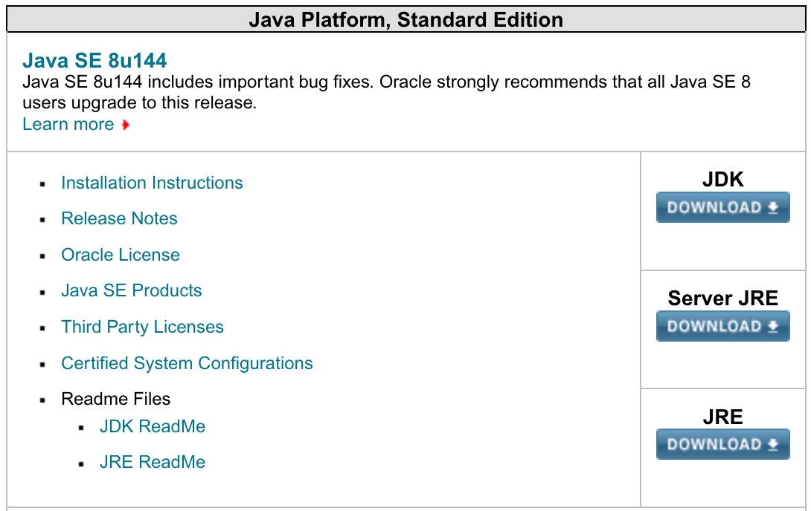

# Installation de Java
## Introduction

L'environnement d'exécution Java est nécessaire pour faire tourner certains serveurs (Tomcat, JBoss, Wildfly).

Il est nécessaire de l'installer manuellement car l'implémentation fournie par Oracle est réputée plus stable et mieux implémenter que la version libre de Java.

## Installation de Java pour serveurs Web

Pour debian, la [page sur l'installation de Java](https://wiki.debian.org/Java/Sun) donne les grandes lignes pour une bonne configuration.

### Téléchargement

Se rendre sur la page de téléchargement d'Oracle : http://www.oracle.com/technetwork/java/javase/downloads/index.html

Cliquer sur la version "Server JRE" de Java



Après avoir accepté les accords de licence, télécharger la version *Linux x64*.

Une fois le téléchargement terminé, transférer le fichier vers votre serveur avec `scp` ou un utilitaire équivalent (WinSCP, Filezilla) en utilisant le protocole SFTP.

#### Alternative au téléchargement

Pour éviter de télécharger sur votre poste, il est possible de télécharger depuis un navigateur installé sur votre serveur (*xombrero* par exemple).

### Installation de java-package

Ce paquet est nécessaire pour gérer Java.

Pour cela, il faut ajouter `contrib` à chaque ligne correspondant à un dépôt dans le fichier `/etc/apt/sources.list`

Par exemple, le fichier suivant:

```
# deb cdrom:[Debian GNU/Linux 9.1.0 _Stretch_ - Official amd64 NETINST 20170722-11:28]/ stretch main

#deb cdrom:[Debian GNU/Linux 9.1.0 _Stretch_ - Official amd64 NETINST 20170722-11:28]/ stretch main

deb http://debian.proxad.net/debian/ stretch main
deb-src http://debian.proxad.net/debian/ stretch main

deb http://security.debian.org/debian-security stretch/updates main
deb-src http://security.debian.org/debian-security stretch/updates main

# stretch-updates, previously known as 'volatile'
deb http://debian.proxad.net/debian/ stretch-updates main
deb-src http://debian.proxad.net/debian/ stretch-updates main
```

va devenir :

```
# deb cdrom:[Debian GNU/Linux 9.1.0 _Stretch_ - Official amd64 NETINST 20170722-11:28]/ stretch main

#deb cdrom:[Debian GNU/Linux 9.1.0 _Stretch_ - Official amd64 NETINST 20170722-11:28]/ stretch main

deb http://debian.proxad.net/debian/ stretch main contrib
deb-src http://debian.proxad.net/debian/ stretch main contrib

deb http://security.debian.org/debian-security stretch/updates main contrib
deb-src http://security.debian.org/debian-security stretch/updates main contrib

# stretch-updates, previously known as 'volatile'
deb http://debian.proxad.net/debian/ stretch-updates main contrib
deb-src http://debian.proxad.net/debian/ stretch-updates main contrib
```

Ensuite, pour installer le paquet:

```bash
sudo apt-get update
sudo apt-get install java-package
```

### Installation de la JRE

#### Génération du paquet

La procédure de génération du paquet nécessite d'utiliser `fakeroot`. L'exemple est donné pour la version 8 update 144. Il est nécessaire d'adapter les commandes à la version téléchargée précédemment.

Il faut se placer dans le répertoire où se trouve le fichier téléchargé.

Après avoir taper la commande suivante, vérifier les informations qu'elle affiche puis valider.

```bash
fakeroot make-jpkg server-jre-8u144-linux-x64.tar.gz
```

Une fois le processus terminé, un nouveau fichier a été créé dans le répertoire courant:

```bash
$ ls
oracle-java8-server-jre_8u144_amd64.deb  server-jre-8u144-linux-x64.tar.gz
```

#### Installation

On installe d'abord une dépendance:
```bash
sudo apt-get install java-common
```

L'installation se fait maintenant en utilisant la commande suivante:

```bash
sudo dpkg -i oracle-java8-server-jre_8u144_amd64.deb
```

#### Sélection de la version Java

Il est possible que plusieurs versions Java soit installées sur votre système.

Il est nécessaire d'installer la bonne.

Pour cela, on liste les versions installées:

```bash
$ sudo update-java-alternatives -l
oracle-java8-server-jre-amd64  317        /usr/lib/jvm/oracle-java8-server-jre-amd64
$
```
