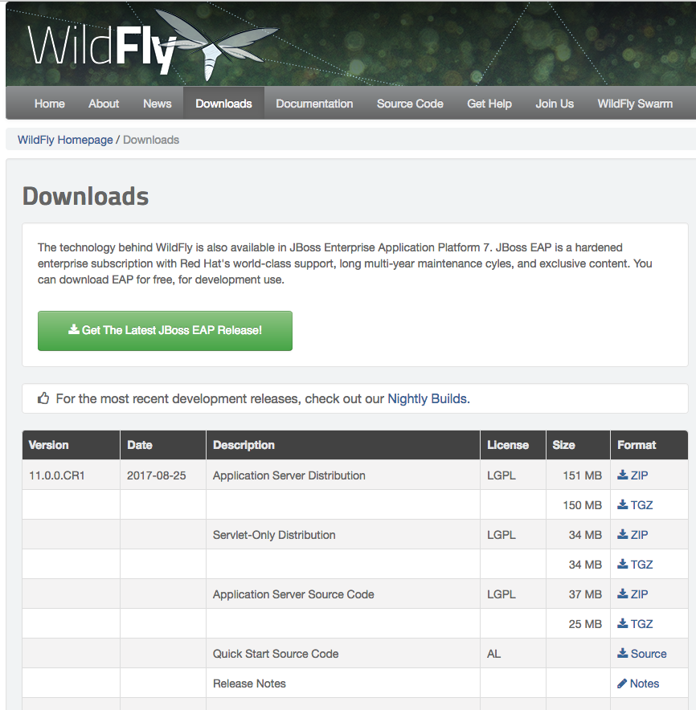

# Installation de Wildfly
## Introduction

L'installation de Wildfly permet de faire tourner un serveur d'applications Java. Il est donc nécessaire d'avoir installé Java sur le serveur cible.


## Récupération du fichier d'installation

La page de téléchargement (http://wildfly.org/downloads/) de Wildfly se présente comme tel:


Le fichier d'installation qui nous intéresse est la dernière version stable. Il porte le suffixe `final`

Les deux premières lignes d'une version pointent vers l'application qui nous intéresse: télécharger le fichier `zip`ou le fichier `tgz`. Il faut copier le lien puis de le coller dans la ligne de commande.

Par exemple :
```bash
wget http://download.jboss.org/wildfly/10.1.0.Final/wildfly-10.1.0.Final.tar.gz
```

## Installation

### Extraction du fichier d'installation

On suppose que le fichier a été précédemment téléchargé dans le répertoire `home` de l'utilisateur.

```bash
cd /opt
sudo tar zxf ~/wildfly-10.1.0.Final.tar.gz
```

Puis on crée un lien pour pointer vers ce répertoire et par conséquent il sera accessible par le chemin `/opt/wildfly`

```bash
sudo ln -s /opt/wildfly-10.1.0.Final /opt/wildfly
```

### Création de l'utilisateur système

Il ne faut pas lancer wildfly en tant que root. On crée donc un utilisateur système et le groupe correspondant:

```bash
sudo adduser --system --group wildfly
```

Et on positionne les droits pour que cet utilisateur soit propriétaire du répertoire d'intallation:

```bash
sudo chown -R wildfly:wildfly /opt/wildfly-10.1.0.Final
```

### Création du fichier de démarrage systemd

Pour permettre à `wildfly` de démarrer au lancement du système, il faut créer le fichier `/lib/systemd/system/wildfly.service`


```ini
[Unit]
Description=WildFly application server
After=network.target

[Service]
Type=simple
User=wildfly
Group=wildfly
ExecStart=/opt/wildfly/bin/standalone.sh

[Install]
WantedBy=multi-user.target
```

Il est possible de mettre des arguments à la ligne de lancement (par exemple `/opt/wildfly/bin/standalone.sh -b 192.168.2.3`).

Une fois créé, il suffit d'utiliser la commande `systemctl` pour gérer le service:

```bash
#Démarrer the service
systemctl start wildfly

#Arrêter the service
systemctl stop wildfly

#Activer  the service au démarrage
systemctl enable wildfly

#Désactiver au démarrage
systemctl disable wildfly

#Vérifier si le service est activé au démarrage
systemctl is-enabled wildfly

#Désactiver totalement le service
systemctl mask wildfly
```
